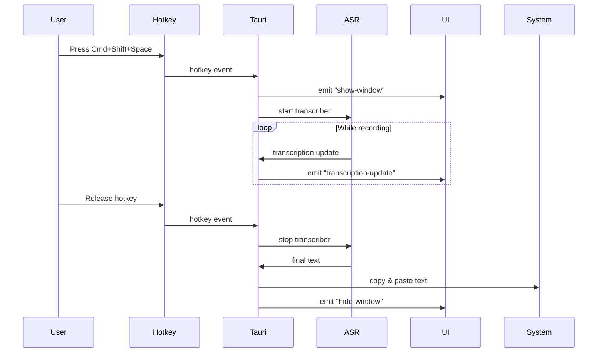

# Design Document: Background Transcription App

## Overview

This design document describes a macOS background transcription application built with Tauri, React, and Rust. The application leverages the existing Whisper-based ASR implementation to provide a SuperWhisper-like experience: users press a global hotkey to start recording, see live transcription in a popup window, and have the text automatically pasted into their active application.

The architecture follows a clean separation between the Rust backend (Tauri commands, system integration, ASR processing) and the React frontend (UI rendering, user settings). The existing `asr` module provides the core transcription functionality, which we'll integrate with new system tray, hotkey, and window management components.

## Architecture

### High-Level Flow



## Components and Interfaces

### 1. Application State

Simple shared state for the Tauri app:

```rust
pub struct AppState {
    transcriber: Arc<Mutex<Option<RealtimeTranscriber>>>,
    is_recording: Arc<AtomicBool>,
    settings: Arc<Mutex<Settings>>,
}
```

### 2. Settings

Configuration stored as JSON in `~/Library/Application Support/unterwhisper/config.json`:

```rust
#[derive(Serialize, Deserialize, Clone)]
pub struct Settings {
    pub model: String,           // "distil-large-v3.5"
    pub language: Option<String>, // "en" or null
}

impl Settings {
    fn load() -> Result<Self>;
    fn save(&self) -> Result<()>;
    fn default() -> Self;
}
```

### 3. Core Functions

Composable functions for main operations:

```rust
// Hotkey handling
fn setup_hotkey(app: AppHandle) -> Result<()>;
fn handle_hotkey_event(app: AppHandle, event: GlobalHotKeyEvent);

// Recording control
fn start_recording(state: &AppState, app: AppHandle) -> Result<()>;
fn stop_recording(state: &AppState, app: AppHandle) -> Result<String>;

// Transcription polling
fn poll_transcription(state: &AppState, app: AppHandle);

// Clipboard operations
fn copy_and_paste(text: &str) -> Result<()>;

// Window control
fn show_window(app: &AppHandle, label: &str) -> Result<()>;
fn hide_window(app: &AppHandle, label: &str) -> Result<()>;
```

### 4. Tauri Commands

Simple command handlers:

```rust
#[tauri::command]
fn get_settings(state: State<AppState>) -> Result<Settings>;

#[tauri::command]
fn update_settings(state: State<AppState>, settings: Settings) -> Result<()>;

#[tauri::command]
fn manual_start_recording(state: State<AppState>, app: AppHandle) -> Result<()>;

#[tauri::command]
fn manual_stop_recording(state: State<AppState>, app: AppHandle) -> Result<String>;
```

## Data Models

### Configuration File

**Location**: `~/Library/Application Support/unterwhisper/config.json`

**Format**:
```json
{
  "model": "distil-large-v3.5",
  "language": null
}
```

**Default Values**:
- Model: `distil-large-v3.5`
- Language: Auto-detect (null)

### Frontend State

```typescript
interface TranscriptionState {
  isRecording: boolean;
  currentText: string;
}
```

## Correctness Properties

*A property is a characteristic or behavior that should hold true across all valid executions of a system—essentially, a formal statement about what the system should do. Properties serve as the bridge between human-readable specifications and machine-verifiable correctness guarantees.*

### Property 1: Settings Persistence Round-Trip

*For any* valid Settings object, saving then loading should produce an equivalent settings object with all fields preserved.

**Validates: Requirements 6.5, 6.6, 7.2**

### Property 2: Recording State Consistency

*For any* sequence of start/stop recording commands, the is_recording flag should always match whether the transcriber is actually running.

**Validates: Requirements 4.1, 4.4**

### Property 3: Transcription Text Accumulation

*For any* sequence of transcription updates during a recording session, the displayed text should never lose content (monotonically growing) until recording stops.

**Validates: Requirements 3.2, 3.3**

### Property 4: Configuration File Validation

*For any* configuration file content, if the JSON structure is invalid or corrupted, the system should reset to defaults and continue operating without crashing.

**Validates: Requirements 7.3, 7.4**

## Error Handling

### Error Categories

1. **Permission Errors**
   - Microphone access denied
   - Accessibility permissions denied (for hotkey)
   - File system access denied (for settings)

2. **Resource Errors**
   - Whisper model failed to load
   - Audio device not available
   - Insufficient memory

3. **State Errors**
   - Invalid hotkey configuration
   - Corrupted settings file
   - Recording already in progress

4. **System Errors**
   - Clipboard access failed
   - Window creation failed
   - Tray icon creation failed

### Error Handling Strategy

**User-Facing Errors**: Display native macOS notifications with actionable messages

**Recoverable Errors**: Log and attempt graceful degradation (e.g., use default settings if config is corrupted)

**Fatal Errors**: Display error dialog and exit cleanly

**Error Logging**: Write to `~/Library/Application Support/unterwhisper/logs/app.log`

### Error Response Examples

```rust
// Permission error
if !has_microphone_permission() {
    show_notification(
        "Microphone Access Required",
        "Please grant microphone access in System Settings > Privacy & Security"
    );
    return Err(AppError::PermissionDenied);
}

// Resource error with fallback
let model = match load_whisper_model(&config.model) {
    Ok(m) => m,
    Err(e) => {
        log::warn!("Failed to load model {}: {}", config.model, e);
        show_notification(
            "Model Load Failed",
            &format!("Falling back to default model: {}", e)
        );
        load_whisper_model("tiny.en")?
    }
};

// State error
if is_recording {
    return Err(AppError::AlreadyRecording);
}
```

## Testing Strategy

### Unit Tests

Unit tests will focus on specific examples and edge cases:

1. **Settings**
   - Test loading valid config files
   - Test handling corrupted JSON
   - Test default value creation

2. **Clipboard Operations**
   - Test copy and paste
   - Test handling empty text

3. **Window Control**
   - Test show/hide operations

### Property-Based Tests

Property-based tests will verify universal properties using the `quickcheck` crate (minimum 100 iterations per test):

1. **Property 1: Settings Persistence Round-Trip**
   - Generate random valid Settings
   - Save and load
   - Verify equality

2. **Property 2: Recording State Consistency**
   - Generate random sequences of start/stop commands
   - Verify state always matches actual recording status

3. **Property 3: Transcription Text Accumulation**
   - Generate random sequences of transcription updates
   - Verify text never loses content

4. **Property 4: Configuration File Validation**
   - Generate random JSON (valid and invalid)
   - Verify system handles gracefully

### Integration Tests

1. **End-to-End Recording Flow**
   - Trigger hotkey → verify window shows → verify recording starts → verify transcription updates → verify paste

2. **Settings Persistence**
   - Update settings → restart app → verify settings loaded

### Test Configuration

All property-based tests will:
- Run minimum 100 iterations
- Use tags: `Feature: background-transcription, Property {N}: {property_text}`
- Be implemented using the `quickcheck` crate for Rust

## Implementation Notes

### Tauri Window Configuration

**tauri.conf.json** updates needed:

```json
{
  "app": {
    "windows": [
      {
        "label": "transcription",
        "title": "Transcription",
        "width": 600,
        "height": 200,
        "center": true,
        "decorations": false,
        "transparent": true,
        "alwaysOnTop": true,
        "visible": false,
        "skipTaskbar": true
      }
    ],
    "systemTray": {
      "iconPath": "icons/tray-icon.png"
    }
  }
}
```

### Cargo Dependencies

Additional crates needed:

```toml
[dependencies]
# Existing
tauri = { version = "2", features = ["system-tray"] }
global-hotkey = "0.7"

# New
arboard = "3.4"           # Clipboard access
enigo = "0.2"             # Keyboard simulation for paste
dirs = "5.0"              # Standard directory paths
anyhow = "1.0"            # Error handling
candle-core = "0.8"       # Already used by ASR
```

### React Component

**TranscriptionWindow.tsx**:
- Display live transcription text
- Semi-transparent background
- Auto-sizing based on text length
- Listen for "transcription-update" events

### macOS Permissions

Required entries in `Info.plist`:

```xml
<key>NSMicrophoneUsageDescription</key>
<string>Unterwhisper needs microphone access to transcribe your speech.</string>

<key>NSAppleEventsUsageDescription</key>
<string>Unterwhisper needs accessibility access to register global hotkeys and paste transcribed text.</string>
```

### Event Communication

Use Tauri's event system for real-time updates:

```rust
// Backend emits events
app_handle.emit_all("transcription-update", text)?;
app_handle.emit_all("show-window", ())?;
app_handle.emit_all("hide-window", ())?;

// Frontend listens
import { listen } from '@tauri-apps/api/event';

listen('transcription-update', (event) => {
    setTranscriptionText(event.payload);
});
```

## Future Enhancements

1. **Settings UI**: Add a settings window for model/language configuration
2. **Transcription History**: Keep a searchable history of past transcriptions
3. **Custom Hotkeys**: Allow users to configure the hotkey
4. **Streaming Mode**: Continuous transcription without hotkey press
